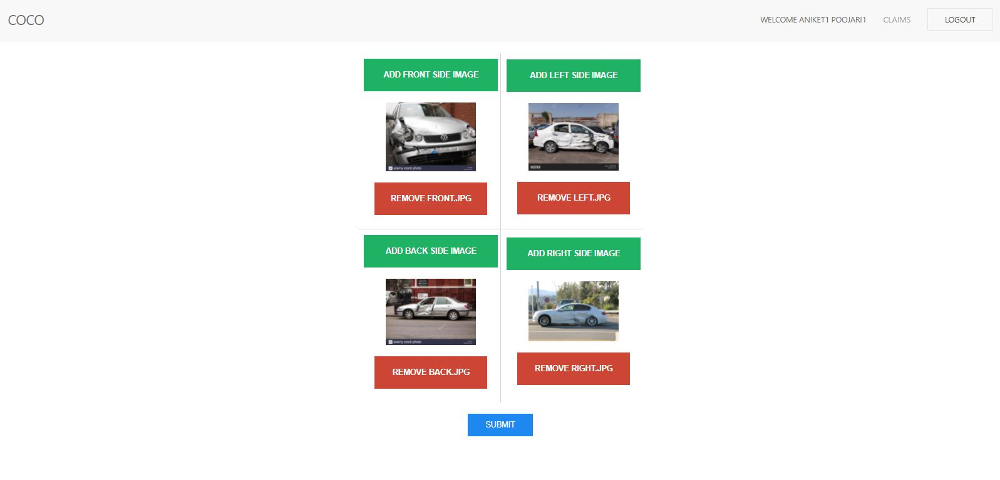
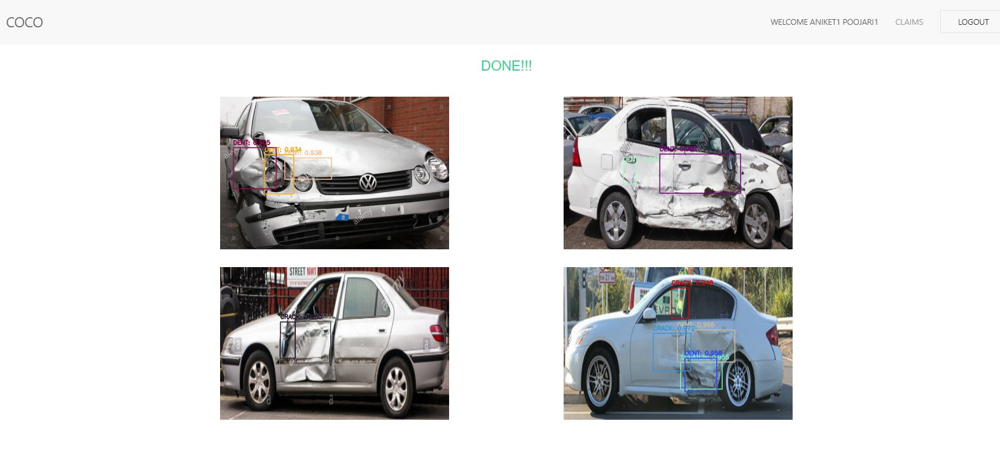
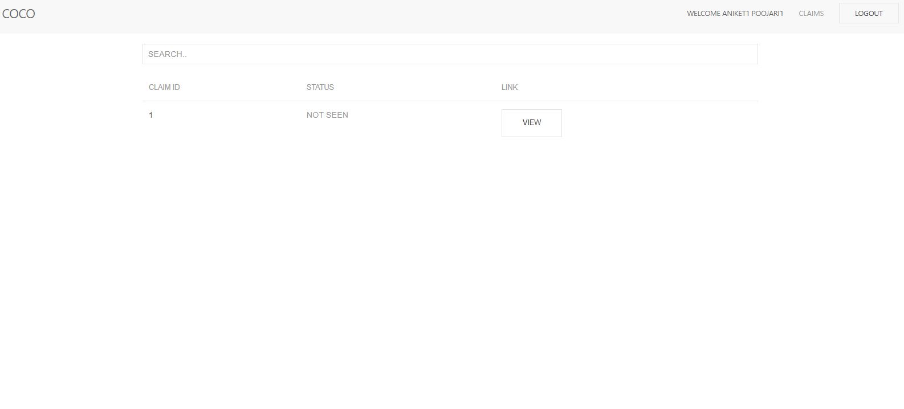
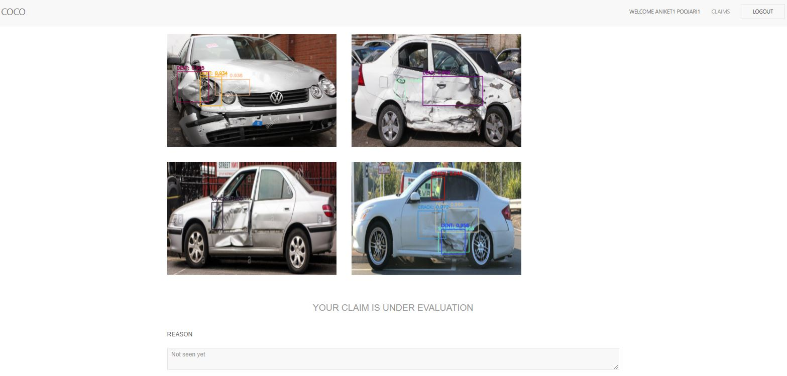
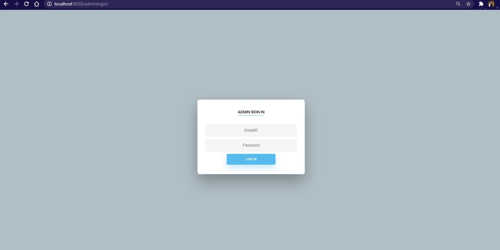
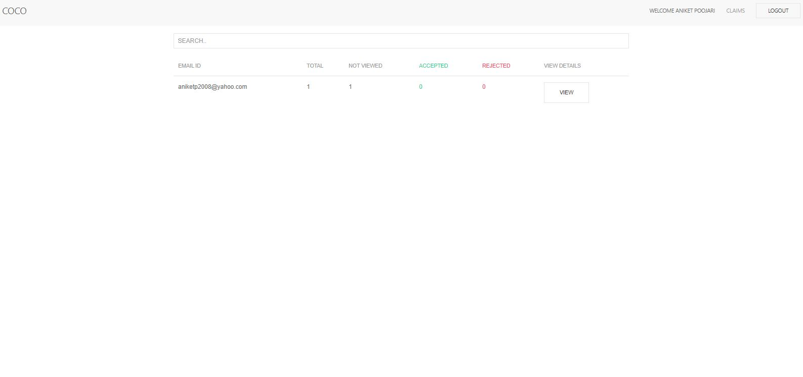

# MOTOR SELF INSPECTION
- A Mask RCNN model integrated with a website able to detect damages on a vehicle for vehicle claim approval at insurance firm
- Used: Django, Python, Keras, OpenCV, Mask-RCNN, HTML, CSS, AJAX

## LOL

- Add Images of all the sides of the car

- Results of the detection

- All claims listed

- Status of individual claim

- Admin login

- Admin can approve or reject the claims of any customer
